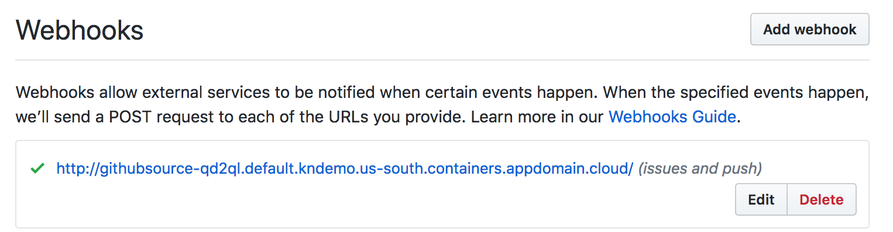

# HelloWorld!

## My First Knative Demo

Note: this version uses Knative v0.4.0. Look at the
[releases](https://github.com/duglin/helloworld/releases) to find instructions
for how to run the demo on older versions.

This repo contains the source code, tools and instructions for a demo that
shows using Knative on the
[IBM Cloud Kubernetes Service](https://cloud.ibm.com). You can pretty easily
convert it to work on other platforms. The main reasons behind this
are:
- for me to learn more about Knative
- to share my experiences during this exercise
- highlight some areas where I think Knative can be improved and I'll
  be opening up issues for these things

When you run some of the scripts, it will show the commands in bold
and the output of the commands in normal text. When it pauses, just press
the spacebar to move to the next step. If the slow typing is annoying, press
`f` when it pauses and it'll stop that.

Also, these scripts are tested on Ubuntu, I haven't tried them on MacOS
yet so don't be surprised if things don't work there yet. PR are welcome
though.

So, with that, let's get started...

## Canned demo!

If you just want to see what a successful demo looks like without actually
doing anything, like even installing Kubernetes or Knative, just run this:

```
$ USESAVED=1 ./demo
```

And press the spacebar to walk through each command. The output should look
basically the same as a live-run (even with delays at the right times) to make
it look-n-feel like it's live!  Great for situations where your network
isn't reliable, or the demo Gods are mad at you.

## Prep

After you fork and clone this repo you'll need to create a `.secrets` file in
the root of the clone directory that looks like this:

```
git_accesstoken=...
git_secrettoken=...
username=...
password=...
```

Where:
- `git_accesstoken` is a [Github Personal Access Token](https://github.com/settings/tokens)
- `git_secrettoken` is the secret token you want the events from Github to use to verify they're authenticated with your Knative subscription. This can basically be any random string you want.
- `username` is your Dockerhub username
- `password` is your Dockerhub password

I store all of the secret information I use during the demo in there. It's
safer to put them in there than to put them into the real files of the repo
and run the risk of checking them into github by mistake.

The rest of this assumes you:
- are already logged into the IBM Cloud (`ibmcloud login`)
- and have all of the appropriate CLI tools installed - see:
  https://github.com/IBM/knative101/workshop/exercise-0/README.md

## Creating a Kubernetes cluster

Note: in order to run this demo you'll need a cluster with at least 3
worker nodes in it. As of now this means that you can not use a free-tier
cluster.

Clearly, we first need a Kubernetes cluster. And, I've automated this
via the `mkcluster` script in the repo. The script assumes you're using the
Dallas data center, so if not you'll need to modify it.

To create the cluster just run:
```
$ ./mkcluster CLUSTER_NAME
```

You can then skip to the next section.


If you decide to create it manually, then you'll first need to get some info
about our LANs since the `ibmcloud ks cluster-create` command requires that:

```
$ ibmcloud ks vlans --zone dal13
OK
ID        Name   Number   Type      Router         Supports Virtual Workers
PRIV_??          1240     private   bcr02a.dal13   true
PUB_??           996      public    fcr02a.dal13   true
```

Now we can create the cluster. In this case we'll create it with 3 worker
nodes. Replace the `PRIV_??` and `PUB_??` with  the values you see from the
`ibmcloud ks vlans` command - and replace `dal13` with whatever data center you
want to use.

```
$ ibmcloud ks cluster-create --name CLUSTER_NAME --zone dal13 \
    --machine-type ${MACHINE} --workers 3 \
	--private-vlan PRIV_?? --public-vlan PUB_??  \
    --kube-version 1.13.2
Creating cluster...
OK
```

Once the cluster is ready you'll need to set your `KUBECONFIG`
environment variable to point to your customized Kubernetes config file:

```
$(ibmcloud ks cluster-config --export CLUSTER_NAME)
```

Now we can install Knative...

Knative requires Istio, but luckily IBM Cloud's Kubernetes service's install
of Knative will install Istio too - just run:

```
$ ibmcloud ks cluster-addon-enable knative CLUSTER_NAME
```
If it prompts you to install Istio, just say `yes`, even if you have
Istio already installed - worst case, it'll upgrade it for you.

Since Knative is still very much a work-in-progress, and while the IKS
team will try to keep up with the latest versions, if you happen to catch
things at a time when the IKS install of Knative is behind the latest
version, just follow
[these instructions](https://knative.dev/docs/install/knative-with-iks/)
for how to install the latest Knative manually.

This will take a moment or two, and you can see it's done when two
things happen, first you see the Istio and Knative namespaces:

```
$ kubectl get ns -w
NAME                 STATUS   AGE
default              Active   39h
ibm-cert-store       Active   39h
ibm-system           Active   39h
istio-system         Active   21h    <----
knative-build        Active   18h    <----
knative-eventing     Active   18h    <----
knative-monitoring   Active   18h    <----
knative-serving      Active   18h    <----
knative-sources      Active   18h    <----
kube-public          Active   39h
kube-system          Active   39h
```

When you see the `istio-system` and the `knatve-...` ones appear then
you're almost done. Press control-C to stop the watch

Next, check to see if all of the pods are running. I find it easiest
to just see if there are any pods that are not running, via this:

```
$ kubectl get pods --all-namespaces | grep -v Running
```

And if that list is empty, or only shows non-Istio and non-Knative pods
(due to other things running in your cluster) then you should be go to go.
If the list isn't empty, then give it more time for things to initialize.

## Running the demo

You can now either run the `demo` script to have it automatically run through
the demo, providing commentary, or you can do it all manually.

Which ever way you run the demo, I'd run `./pods` in another window so
you can see the Knative Services and Pods as they come-n-go. Make sure
you run `$(ibmcloud ks cluster-config --export CLUSTER_NAME)` in that other
window too.

### Using the `demo` script

If you're going to run the `demo` script then you'll need to modify these
lines in there:

```
export APP_IMAGE=${APP_IMAGE:-duglin/helloworld}
export REBUILD_IMAGE=${REBUILD_IMAGE:-duglin/rebuild}
export GITREPO=${GITREPO:-duglin/helloworld}
```

Change the `APP_IMAGE` and `REBUILD_IMAGE` values to use your
Dockerhub namespace name instead of `duglin`, and change `GITREPO`
to be the name of your Github clone of this repo - typically you should
just need to swap `duglin` for your Github name.

```
$ ./demo [ CLUSTER_NAME ]
```
`CLUSTER_NAME` is optional if your `KUBECONFIG` environment variable
already points to your IKS cluster.

When done you can jump the the [Cleaning Up](#cleaning-up) section.


### Manually running the demo / Demo details

Before you begin, set these environment variables:

```
$ export APP_IMAGE=duglin/helloworld
$ export REBUILD_IMAGE=duglin/rebuild
$ export GITREPO=duglin/helloworld
```

Set `APP_IMAGE` and `REBUILD_IMAGE` values to use your
Dockerhub namespace name instead of `duglin`, and change `GITREPO`
to be the name of your Github clone of this repo - typically you should
just need to swap `duglin` for your Github name.

#### Setup our network

Before we go any further, we'll need to modify our Istio configuration so that
it allows outbound network traffic from our pods. By default Istio blocks all
outbound traffic. To do this I have this `ingress.yaml` file:

```
# Allow for pods to talk to the internet
apiVersion: v1
kind: ConfigMap
metadata:
  annotations:
    kubectl.kubernetes.io/last-applied-configuration: |
      {"apiVersion":"v1","data":{"istio.sidecar.includeOutboundIPRanges":"*"},"kind":"ConfigMap","metadata":{"annotations":{},"name":"config-network","namespace":"knative-serving"}}
  name: config-network
  namespace: knative-serving
data:
  istio.sidecar.includeOutboundIPRanges: 172.30.0.0/16,172.20.0.0/16,10.10.10.0/24
```

Install this resouce:

```
$ ./kapply ingress.yaml
configmap/config-network created
```

We'll talk more about the `kapply` command later.

#### Secrets

Before we get to the real point of this, which is deploying an application,
I needed to create a Kuberneres Secret that holds all of the private
keys/tokens/usernames/etc... that will be used during the demo.
I also needed to create some new RBAC rules so that our "rebuild" service,
which is running under the "default" Service Account,
has the proper permissions to access and edit the Knative Service to force it
to rebuild - which I'll talk more about later.

For all of these things I have the `secrets.yaml` file:

```
apiVersion: v1
kind: Secret
metadata:
  name: mysecrets
  annotations:
    build.knative.dev/docker-0: https://index.docker.io/v1/
type: kubernetes.io/basic-auth
stringData:
  git_accesstoken: ${.secrets.git_accesstoken}
  git_secrettoken: ${.secrets.git_secrettoken}
  username: ${.secrets.username}
  password: ${.secrets.password}
---
apiVersion: v1
kind: ServiceAccount
metadata:
  name: build-bot
secrets:
- name: mysecrets


---
# Give our "default" ServiceAccount permission to touch Knative Services
apiVersion: rbac.authorization.k8s.io/v1
kind: ClusterRole
metadata:
  name: rebuild
rules:
- apiGroups:
  - serving.knative.dev
  resources:
  - services
  verbs:
  - get
  - list
  - update
  - patch
---
apiVersion: rbac.authorization.k8s.io/v1
kind: ClusterRoleBinding
metadata:
  name: rebuild-binding
roleRef:
  apiGroup: rbac.authorization.k8s.io
  kind: ClusterRole
  name: rebuild
subjects:
- kind: ServiceAccount
  name: default
  namespace: default
```

You'll notice some environment variable looking values in there. Obviously,
those are not normal Kube yaml things. To make life easier, I created
a script called `kapply` which takes a yaml file and replaces references
like those with their real values before invoking `kubectl apply`. This allows
me to share my yaml with you w/o asking you to modify these files and run
the risk of you checking them into your github repo by mistake. All you need
to do is create the `.secrets` files I mentioned at the top of this README.

The you can create the secret via:

```
$ ./kapply secrets.yaml
secret/mysecrets created
serviceaccount/build-bot created
clusterrole.rbac.authorization.k8s.io/rebuild created
clusterrolebinding.rbac.authorization.k8s.io/rebuild-binding created
```

#### Install the Kaniko build template

Almost there! Let's install the Kaniko build template:

```
$ kubectl apply -f https://raw.githubusercontent.com/knative/build-templates/master/kaniko/kaniko.yaml
buildtemplate.build.knative.dev/kaniko created
```

Build templates are like CloudFoundry buildpacks, they'll take your source
and create a container image from it, and then push it to some container
registry. If you look at the yaml for this resource you'll see something
like this:

```
apiVersion: build.knative.dev/v1alpha1
kind: BuildTemplate
metadata:
  name: kaniko
spec:
  parameters:
  - name: IMAGE
    description: The name of the image to push
  - name: DOCKERFILE
    description: Path to the Dockerfile to build.
    default: /workspace/Dockerfile

  steps:
  - name: build-and-push
    image: gcr.io/kaniko-project/executor
    args:
    - --dockerfile=${DOCKERFILE}
    - --destination=${IMAGE}
    env:
    - name: DOCKER_CONFIG
      value: /builder/home/.docker
```

Most of what's in there should be obvious:
- `image: gcr.io/kaniko-project/executor` defines the container image that will
  be used to actually do all of the work of building things.
- `args` are the command line flags to pass to builder container
- `env` defines some enviornment variables for that container
- `parameters` define some parameters that users of the template can specify
- `steps` allows for you to define a list of things to do in order to build
  the image

What's interesting about this to me is that I'm wondering if this is
overly complex and overly simplified at the same time. What I mean by that
is this... the template provides an image to do all sorts of magic to build
our image - that part makes sense to me. However, they then suggest that
people will want to mix-n-match the calling of multiple images/steps by
allowing template owners to define `steps`. Why not just put all of that
logic into the one image?

If the argument is that you may need to string these steps together, then
why do we think we can get by with a simple ordered list? It won't be long
before people need real control flow (like `if` statements) between the
steps. It seems to me it would be better to tell people to just put all of
the logic they need into an image and do whatever orchestration of steps
within that. Let's not head down the path of inventing some kind of scripting
language here. That's why I think it's overly complex (I don't see the need
for `steps`) and overly simplified (if you do see the need then a simple list
isn't sufficient in the long run). The point is, it should be trivially easy
to create new BuildTemplates so that anyone can do it any time, and we don't
need a more formalized/complex system.

And finally, originally I didn't use Build Templates, I just put a reference
to the Kaniko image directly into my Service definition's build section and
that, of course, worked with basically the same amount of yaml - but didn't
introduce a level of indirection that could only lead to added perception
of complexity. But I gave in and added Build Templates so I could
ramble about them here :-)

Anyway, moving on...

#### Our application

For this demo I'm just using a very simple HTTP server that responds
to any request with `Hello World!`, here's the source
([`helloworld.go`](https://github.com/duglin/helloworld/blob/master/helloworld.go)):

```
package main

import (
	"fmt"
	"net/http"
	"os"
	"strings"
	"time"
)

func main() {
	text := "Hello World!"

	rev := os.Getenv("K_REVISION") // K_REVISION=helloworld-7vh75
	if i := strings.LastIndex(rev, "-"); i > 0 {
		rev = rev[i+1:] + ": "
	}

	msg := fmt.Sprintf("%s%s\n", rev, text)

	http.HandleFunc("/", func(w http.ResponseWriter, r *http.Request) {
		fmt.Printf("Got request\n")
		time.Sleep(500 * time.Millisecond)
		fmt.Fprint(w, msg)
	})

	fmt.Printf("Listening on port 8080 (rev: %s)\n", rev)
	http.ListenAndServe(":8080", nil)
}
```

The `sleep` is in there just to slow things down a bit so that when we
increase the load on the app it'll cause one instance of the app to be
created for each client we have generating requests.

The app will print part of the `K_REVISION` environment variable so
we can see which revision number of our app we're hitting.

If you look in the `Makefile` you'll see how I built and pushed it
to my namespace in Dockerhub:

```
docker build -t $(APP_IMAGE) .
docker push $(APP_IMAGE)
```

You'll need to modify the `Makefile` to point to your DockerHub
namespace if you want to use `make`.

Now, our first adventure with Knative... let's deploy the application
as a Knative Service. First, do not confuse a Knative Service with
a Kubernetes Service - they're not the same thing. This is an on-going
point of discussion within the Knative community, so for now we just
need to live with it.

We'll first deploy our Knative Service the really easy way, via the
Knative `kn` command line tool. The source code is available at
https://github.com/knative/client but there is no distribution yet, so
you'll have to build it yourself. For convinience, I've included the
`kn` exectuable in this directory - but it's only for Linux.

```
$ ./kn service create helloworld --image $(APP_IMAGE)
Service 'helloworld' successfully created in namespace 'default'.
```

As should be clear from the first two arguments this `kn` command is creating
a service. The next argument is the service name (`helloworld`) and
then we give it the name/location of the container image to use.

Once that's done, if you want a couple of seconds for the image to download,
you should then be able to ask for the list of services:
```
$ ./kn service get
NAME         DOMAIN                                                          GENERATION   AGE   CONDITIONS   READY   REASON
helloworld   helloworld.default.kndemo.us-south.containers.appdomain.cloud   1            46s   3 OK / 3     True
```

Notice that in there it will show you the full URL of the service that
you can then curl against:

```
$ curl -sf helloworld.default.kndemo.us-south.containers.appdomain.cloud
c8xg6: Hello World!
```

With that, you've now successfully deploy a Knative Service and behind
the scenes it created all of the Kubernetes resources to host it, scale
it, route traffic to it and even give it a relatively nice URL.

One more thing.... you can also access it via SSL:
```
$ curl -sf https://helloworld.default.kndemo.us-south.containers.appdomain.cloud
c8xg6: Hello World!
```

So, you also get security too! All with one simple command.

Let's take a quick look at all of the resources that were created
for us:

```
$ ./showresources all
deployment.apps/helloworld-hqfkl-deployment
endpoint/helloworld-hqfkl-service
endpoint/kubernetes
pod/helloworld-hqfkl-deployment-bfc557bb7-llrql
replicaset.apps/helloworld-hqfkl-deployment-bfc557bb7
service/helloworld
service/helloworld-hqfkl-service
service/kubernetes

buildtemplate.build.knative.dev/kaniko
clusterchannelprovisioner.eventing.knative.dev/in-memory
clusteringress.networking.internal.knative.dev/route-8e49eb80-7a0e-11e9-8195-5ee
95b627dab
configuration.serving.knative.dev/helloworld
image.caching.internal.knative.dev/helloworld-hqfkl-cache
image.caching.internal.knative.dev/kaniko-19737443-00000
podautoscaler.autoscaling.internal.knative.dev/helloworld-hqfkl
revision.serving.knative.dev/helloworld-hqfkl
route.serving.knative.dev/helloworld
service.serving.knative.dev/helloworld
```

The first list is the list of native Kube resources, and the second list
contains the Knative ones. That's a lot of stuff!  And I mean that in a
good way! One of my goals for Knative is to offer up a more user
friendly user experience for Kube users. Sure Kube has a ton of features
but with that flexibility has come complexity. Think about how much learning
and work is required to setup all of these resources that Knative as done
for us. I no longer need to understand Ingress, load-balancing, auto-scaling,
etc. Very nice!

Back to our demo...

The `kn` command line is still under development so for the rest of this
write-up I'm going to switch back to the normal Kubernetes CLI, `kubectl`.
And to do that, let's delete this service so we can see how to do it
with `kubectl`.

```
$ ./kn service delete helloworld
Service 'helloworld' successfully deleted in namespace 'default'.
```

Let's first look at our yaml file that defines our Knative Service
defined in `service1.yaml`:

```yaml
apiVersion: serving.knative.dev/v1alpha1
kind: Service
metadata:
  name: helloworld
spec:
  runLatest:
    configuration:
      revisionTemplate:
        spec:
          container:
            image: ${APP_IMAGE}
          containerConcurrency: 1
```

Let's explain what some of these fields do:
- `metadata.name`: Like all Kube resources, this names our Service
- `runLatest`: here we have some choices as to how we define our Service.
  In particular we can specify one or multiple containers and that will
  not only control what is currently being run, but how we want to do a
  rolling upgrade to a new version - for example, how much traffic do we want
  to go to v1 versus v2 of our app. I'm not going to go into this now,
  so we'll just use `runLatest` which takes a single container definition.
- `configuration`: just a wrapper. In my opinion this should be removed,
  it serves no real purpose. Under the covers Knative will create a
  `Configuration` resource for this nested data, but that doesn't mean
  we need to expose it to the user.
- `revisionTemplate`: Each version of our application is called a
  `revision`. So, what we're doing here is defining a version of our app
  and its `image` value.
- `containerConcurrency`: this tells the system how many concurrent
  requests to allow to each instance of our app at a single time. When
  that threshold is met, the app will be scalled up and new instances
  are created.

Now we can deploy it:

```
$ ./kapply service1.yaml
service.serving.knative.dev/helloworld created
```

If you're not running `pods` in another window, run it now to see what
happened:

```
$ ./pods
Cluster: kndemo
K_SVC_NAME                     LATESTREADY                    READY
helloworld                     helloworld-s824d               True

POD_NAME                                                STATUS           AGE
helloworld-s824d-deployment-78796cb584-jswh6            Running          90s
```

The output of `pods` shows the list of Knative services (at the top)
followed by the list of active pods.

When the pod is in the `Running` state, press control-C to stop it.

You should see your `helloworld` Knative service with one revision
called something like `helloworld-s824d`, and a pod with a really funky name
but that starts with that revision name.

Notice the word "deployment" in there - that's because under the covers
Knative create a Kubernetes deployment resource and this pod is related
to that deployment.

So, it's running - let's invoke it. Before we do, we first need to know
the full URL of the service, to find that do this:

```
$ kubectl get ksvc
NAME         DOMAIN                                                          LATESTCREATED      LATESTREADY        READY   REASON
helloworld   helloworld.default.kndemo.us-south.containers.appdomain.cloud   helloworld-s824d   helloworld-s824d   True
```

You'll notice that once the Service is ready the "DOMAIN" column will show
the full URL of the Service and that's what we'll use to call it.

```
$ curl -sf helloworld.default.kndemo.us-south.containers.appdomain.cloud
s824d: Hello World!
```

That's it. Once we got past the setup (which is a bit much, but I'm hoping
is just a one-time thing for most people), the deployment of the app itself
was a single `kuebctl` command with a single resource definition. That's
a huge step forward for Kube users

#### Adding build

So, our first app is pretty simple, we just point to a pre-built container
image. However, Knative has the ability to build the image for you. Let's look
at the
[`service2.yaml`](https://github.com/duglin/helloworld/blob/master/service2.yaml)
file to add this build logic:

```
apiVersion: serving.knative.dev/v1alpha1
kind: Service
metadata:
  name: helloworld
spec:
  runLatest:
    configuration:
      build:
        apiVersion: build.knative.dev/v1alpha1
        kind: Build
        metadata:
          annotations:
            trigger: "15"
        spec:
          serviceAccountName: build-bot
          source:
            git:
              revision: master
              url: https://github.com/${GITREPO}
          template:
            name: kaniko
            arguments:
            - name: IMAGE
              value: index.docker.io/${APP_IMAGE}
      revisionTemplate:
        spec:
          container:
            image: ${APP_IMAGE}
          containerConcurrency: 1
```

The `revisionTemplate` section at the bottom is the same as before. The
`build` section is pretty verbose, but let's focus on the key bits:
- `serviceAccountName`: this is the Kube Service Account to use when
  running the builder containers.
- `source`: points to our source code. In this case we're pointing to a
  Github repo - and it's `master` branch
- `template`: refers to the Knative Build Template to use to build the image,
  which refers to the Kaniko build template we deployed earlier..
  Also, we're passing in the name of the DockerHub repo to store
  the results.

As I said, it's pretty verbose, but not too much info and should be fairly
obvious/easy to understand. But, it would be nice if it were much much
smaller.

Let's deploy this next version of our app's deployment:

```
$ ./kapply service2.yaml
service.serving.knative.dev/helloworld configured
```

If you're not running `./pods` in another window, run it again:

```
$ ./pods
Cluster: kndemo
K_SVC_NAME                     LATESTREADY                    READY
helloworld                     helloworld-p8c2v               True

POD_NAME                                                STATUS           AGE
helloworld-s824d-deployment-d9c684bbf-267hc             Running          2m32s
helloworld-p8c2v-pod-7aeb9b                             Init:2/3         15s
helloworld-p8c2v-deployment-5769dd7756-8n9kj            Running          22s
```

What you'll notice is a "build pod" get created
that will do the build as defined in the yaml. Then you'll see it vanish and a
new `helloworld-p8c2v-deployment...` pod appear. Notice it has "2" in there
as the revision number, not "1". This is because any change to the
`configuration` section of the yaml will cause a new revision to be created.

You should also notice that both revision 1 and revision 2 are running.
That's because Knative did a rolling upgrade - and kepts the old version
around until the new one is ready and working. Revision 1 will eventually
vanish after about 60 seconds since no one is hitting it and no one will
since our routing setup (as of now) will always point to the latest revision.
It's worth noting that revision 2 will vanish too, but only because no one is
hitting it. Once a request comes it, Knative will recreate that pod to handle
the request.

So, let's hit it:

```
$ curl -sf helloworld.default.kndemo.us-south.containers.appdomain.cloud
p8c2v: Hello World!
```

Nothing too exiciting here, it worked as expected - just notice it's showing
`p8c2v` as the revision number, not `s824d`.

#### Hooking it up to Github events

Now that we have the basics of our app dev pipeline defined, let's make it
more exciting by having new versions of our app built and deployed
automatically as new changes are pushed into our Github repo.

For this to work there are a couple of things we need to setup:

- we need a `rebuild` service. This service will do nothing more than
  "poke" our Knative service to kick off a new build. This service will
  be invoked each time a Github "push" event is received.

  As of now, Knative does not have a good way to trigger a new build of
  a service other than for "something" to twiddle the configuration
  of the Service. So, remember in our previous section we added the
  build section to our Service, that was a "twiddle" and we saw it
  do a build. For our purposes, or `rebuild` Service will do almost
  the same thing, it will edit the Service's build section in a
  way to cause Knative to think there's a change and therefore kick off
  a build.

- we'll also need a `github` event source. This is a special resource
  type in Knative that does two things:
  - it will create a webhook in our github repo to send events to
    our Knative installation - which is really a github Knative service
  - it will define the "event sink" for these events, which in our case
    is our `rebuild` Service.

Let's look at the `rebuild` service ([`rebuild.yaml`](https://github.com/duglin/helloworld/blob/master/rebuild.yaml)):
```
apiVersion: serving.knative.dev/v1alpha1
kind: Service
metadata:
  name: rebuild
spec:
  runLatest:
    configuration:
      revisionTemplate:
        spec:
          container:
            image: ${REBUILD_IMAGE}
            env:
            - name: KSVC
              value: helloworld
```

This should look very much like our `helloworld` service definition.
For the most part it is just defining the container image to run
`${REBUILD_IMAGE}`, and passing in the name of the Knative Service to
rebuild.

One thing I will mention here though, when I first wrote the rebuild service
I had a very single-purpose workflow in mind. By that I mean, I knew the
rebuild service would only be called when we got an event, and it only had
to edit the Knative Service's build definition to do its job. So I wrote the
code in
[`rebuild.go`](https://github.com/duglin/helloworld/blob/master/rebuild.go)
to do **just** that - it would do nothing but call `kubectl`. I completely
forgot that this is a Knative Service! Meaning, it is meant to be an HTTP
server waiting for requests - it is not a single-run entity. And, because I
didn't have an HTTP server as part of its logic, after it invoked
`kubectl`, it would exit. But then, of course, Knative/Kube would
interpret this as a "crash" and restart it - resulting in an endless loop of
rebuilds! I'm mentioning this because as you start to chain Services
(or Functions) together, it'll be easy to think of them as simple RPC
entities, and they're not - they're actually mini servers and need to be
written that way. It's obvious when you think about it, but I thought
I'd share my mental lapse.

Let's deploy it:

```
$ ./kapply rebuild.yaml
service.serving.knative.dev/rebuild created
```

Moving on to the Github event source - the yaml for that one is this
([`github.yaml`](https://github.com/duglin/helloworld/blob/master/github.yaml)):

```
apiVersion: sources.eventing.knative.dev/v1alpha1
kind: GitHubSource
metadata:
  name: githubsource
spec:
  eventTypes:
    - push
    - issues
  ownerAndRepository: ${GITREPO}
  accessToken:
    secretKeyRef:
      name: mysecrets
      key: git_accesstoken
  secretToken:
    secretKeyRef:
      name: mysecrets
      key: git_secrettoken
  sink:
    apiVersion: serving.knative.dev/v1alpha1
    kind: Service
    name: rebuild
```

Walking through the fields:
- `eventTypes`: specifies which Github events we're interested in. In this
  case we just need `push` but for fun/testing I also include `issues`
- `ownerAndRepository`: the repo org and name
- `acessToken`: this is the [Github Personal Access
  Token](https://github.com/settings/tokens). Knative needs this to setup
  the webhook
- `secretToken`: is the secret token you want the events from Github to use
  to verify they're authenticated with your Knative subscription. This can
  basically be any random string you want
- `sink`: this is the link to our `rebuild` service. This field holds
  the destination for the incoming events. It could be a service (Knative
  or Kube), or it could be a Knative Channel - which I don't cover in this
  demo.

With that, let's create it:

```
$ ./kapply github.yaml
githubsource.sources.eventing.knative.dev/githubsource created
```

If you go to your gitrepo repo's webhook page you should see an entry
listed in there for it - and it should look something like this:



Don't be surprised if the green check is actually a red "X", sometimes
the first (a verification message) has issues.

With that, we should be all set to test it!

If you modify
[`helloworld.go`](https://github.com/duglin/helloworld/blob/master/helloworld.go)
and push it to the `master` branch it should
initiate the workflow. In this case I'm going to modify the line in there:
```
text := "Hello World!"
```
to be:
```
text := "Now is the time for all good..."
```

And then add/push it:
```
$ git add helloworld.go
$ git commit -m "my demo fun"
$ git push origin master
```

In the `./pods` window you should see something like this:

```
Cluster: kndemo
K_SVC_NAME                     LATESTREADY                    READY
githubsource-b5skr             githubsource-b5skr-s824d       True
helloworld                     helloworld-p8c2v               Unknown
rebuild                        rebuild-s824d                  True

POD_NAME                                                STATUS           AGE
githubsource-b5skr-s824d-deployment-bfdc64c6f-x7dz8     Running          49s
helloworld-p8c2v-deployment-5769dd7756-q5d7j            Running          37s
helloworld-7vh75-pod-6b8b9b                             Init:2/3         25s
rebuild-s824d-deployment-849cb99967-rnwsf               Running          43s
```

Since the `github` and `rebuild` actions are both Knative service you'll
see them listed in the top section, and when
the Github event came into our cluster instances of those services were spun
up, if not
already running. Notice the `helloworld-7vh75-pod-6b8b9b` pod. That's the
build pod for revision 3 (the next version) of our app.

Eventually, that pod will go away and you should see a new "deployment"
pod show up, which is our new version of the app running and ready to be
hit:

```
$ curl -sf helloworld.default.kndemo.us-south.containers.appdomain.cloud
7vh75: Now is the time for all good...
```

There ya go! Notice it say "7vh75" not "p8c2v", and shows our new text instead
of `Hello World!`.

Save the revision name you see, you'll need that in the next section.


### A/B Testing

That's all ok, but notice it rolled out the new version of app and totally
replaced the existing running version. In a more real-world scenario we'd
probably want to roll it out more slowly. To do that, we're going to
actually do a "rollback" to a previous revision.

Let's look at the
[`service-patch.json`](https://github.com/duglin/helloworld/blob/master/service-patch.json)
file we're going to use to do that:

```
[{"op":"replace",
  "path":"/spec",
  "value": {
    "release": {
      "revisions": [ "@latest", "helloworld-${PREVIOUS}" ],
      "rolloutPercent": 10,
      "configuration": {
        "build": {
          "apiVersion": "build.knative.dev/v1alpha1",
          "kind": "Build",
          "metadata": {
            "annotations" : {
              "trigger": "15"
            }
		  },
          "spec": {
            "serviceAccountName": "build-bot",
            "source": {
              "git":{
                "revision": "master",
                "url": "https://github.com/duglin/helloworld"
              }
            },
            "template": {
              "name": "kaniko",
              "arguments": [ {
                "name": "IMAGE",
                "value": "index.docker.io/duglin/helloworld"
              }]
            }
          }
		},
        "revisionTemplate": {
          "spec": {
            "container": {
              "image": "duglin/helloworld"
            },
            "containerConcurrency": 1
          }
        }
      }
    }
  }
}]
```

This will replace the service's `spec` section, which has `runLatest` property,
with a `release` instead. This type of Service configuration sets up a
rolling upgrade mechanism. Notice in the `revisions` property we list
two revision names, `@latest` and `${PREVIOUS}`. The first one in the list
indicates what the "currently running" revision should be.
The second item in the list is the revision we want to "rollout" to, which
in this case is the previous version, p8c2v. If you're doing this manually
you'll need to replace it with the value you were told to save from above.
The `revisionTemplate` section remains unchanged.

Also notice that the `rolloutPercent` tells the system to only send 10%
of the incoming traffic to the "candidate" revision, meaning p8c2v. The idea
is that we'd slowly increase that over time and eventually replace the
`revisions` array with just one value - the "candidate" value, or p8c2v in
our scenario.

So, let's apply the patch:

```
$ ./kapply -p ksvc/helloworld service-patch.json
service.serving.knative.dev/helloworld patched
```

To see this rollout, we'll need to geneate some load. Make sure you've
built the `load` tool (`make load`):

```
$ ./load 10 30 http://helloworld.default.kndemo.us-south.containers.appdomain.cloud
```

What you should see is something like this:
```
01: 7vh75: Now is the time for all good...
02: 7vh75: Now is the time for all good...
03: 7vh75: Now is the time for all good...
04: 7vh75: Now is the time for all good...
05: p8c2v: Hello World!
06: 7vh75: Now is the time for all good...
07: 7vh75: Now is the time for all good...
08: 7vh75: Now is the time for all good...
09: 7vh75: Now is the time for all good...
10: 7vh75: Now is the time for all good...
```

## Summary

With that we're run through a pretty extensive demo. To recap, we:
- deployed a pre-built container image as a Knative service
- added logic to that Service definition so Knative could build it for us
- added a "trigger" mechanism so that as changes are made in our github
  repo, that build logic would happen automatically
- performed a slow rolling upgrade between two versions of our app

AND, notice that aside from initial setup, we pretty much did all of that
via one resource definition.

Now, some things that we glossed over...

During the rolling upgrade we listed some revision names in the the
`revisions` array. That's ok when you know exactly which revisions you
want to deploy but as things change you won't want to continually update
those values. There's work underway to allow you to put special names
in there to mean "current" or "next" - and the system will just know what
revision names/numbers to use. So that will help a lot.

However, the names given to the revisions are machine generated and as such
I don't think are very useful for end-users. While I doubt we want to require
people to name each and every revisions, it would be nice if there was some
way for the user to "tag" a revision so they can easily reference it later.
It would also be a nice way of saying "this one is special and I might need
to reference it again later". For example, if it's an official release.

One thing I didn't get into was that you can make changes to the
`revisionTemplate` in the Service and as you do new revisions of your
app will be created. When you're using the `release` type of Service though
those edits apply to the "candidate" revisions you're slowly rolling out
to. In some ways this is nice because it's a convenient way to incrementally
rollout changes. However, it seems to make it harder for someone to know
exactly what is running in the system.

For example, there's no easy way
(via the `Service` resource) to see the configuration for the current and
candidate revisions side-by-side to see what's going on. Right now you'd have
to go and track down the Revision resources and look at those. It seems
to me that it would be easier for people to understand the state of the
system if they could not only see but define for the entire definition of the
Service and all of its currently running revisions at one time. This would
also allow them to specify more than 2 at a time - and what percentage of
the traffic should go to each one. The idea that there's only ever going to
be two revisions of the same app at one time feels a bit limiting to me.

However, overall what's out there today is a HUGE useability improvement
for developers. The idea of being able to create and manipulate the Kubernetes
resource to do all of these (what I consider) advanced semantics is really
very exciting, and I can't wait to see how things progress.


## Cleaning up

To clean the system so you can run things over and over, just do:

```
$ ./demo --clean
```

It should delete everything except the cluster, Istio and Knative.
